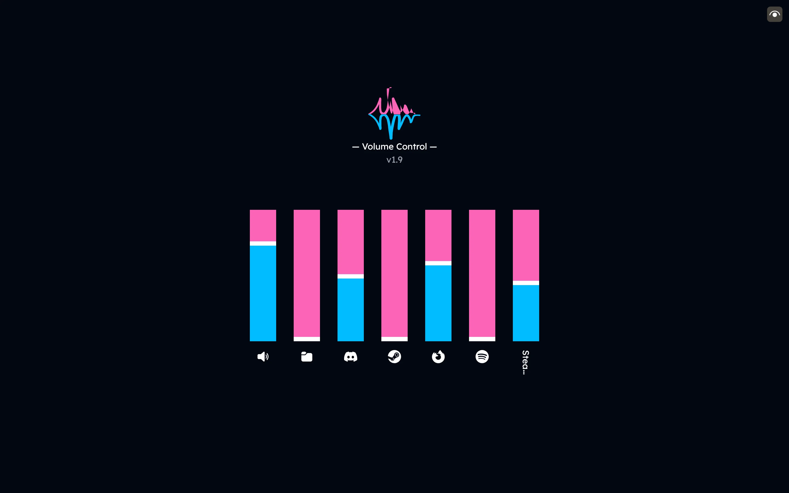

# WinVol-Network

<p align="center">
  
</p>

Simple and lightweight Flask based program that let's you remotely control your Windows PC’s audio volumes from any device on the same network.

<sup><sub>_Now, I don't need to get out of bed just to decrease the volume. 💤_</sub></sup>

### Features
- Change volumes 
- Support PWA (Progressive Web Apps)*
- Simple and lightweight

_* You need to setup your local network to serve https. Check [caddy](https://github.com/caddyserver/caddy)._

### Demo




### Installation

#### Run as python file
1. Clone or download this repository
2. Run _setup.bat_ to install virtual environtment and install dependencies. _(or do it manually)_
3. Run _run.bat_ to run the program.

#### Run as .exe
1. Download executable in release pages
2. You need to put .exe in it's own folder because it will create config file.
3. You can change port in config.yaml

#### Build your own .exe
1. Clone or download this repository
2. Run _setup.bat_ to install virtual environtment and install dependencies. _(or do it manually)_
3. Open terminal and use this
```python
pyinstaller --onefile --noconsole --add-data 'templates:templates' --add-data 'static:static' --icon=icon.ico --name="WinVol-Network" --clean --upx-dir C:\upx-5.0.2-win64 main.py
```

### License

WinVol-Network is released under the [MIT license](./LICENSE).
